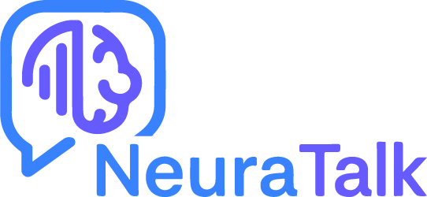

  

  A minimal AI-powered chat application built with Node.js, Vue 3, and Drizzle ORM.

---
## 🚀 Features

| Feature            | Description               |
| -------            | -----------                      |
| AI Chat Integration| Chat with an AI powered by Cohere|
| Minimalist Design  | Clean and intuitive layout with vector-based logo and branding|
| User System        | Basic authentication-like and persistent user chat history|
| Full-Stack Setup   | Vite + Vue 3 front-end and Express/Node.js back-end|

  

## 🛠️ Tech Stack

- **Frontend**: Vue 3, Vite, Tailwind CSS, Pinia
- **Backend**: Node.js, Express, Drizzle ORM
- **Database**: PostgreSQL (Neon/PostgreSQL)
- **AI Provider**: Cohere API 
---

## 🧑‍💻 What I Learned

- How to build and structure a full-stack app using **modern tools** like Vite, Vue, and Drizzle.
- Learned **Drizzle ORM** for type-safe and modern PostgreSQL management.
- Integrated an **AI text generation API** (Cohere) into a real app.
- Handled **deployment issues**, Vite optimization bugs.

---

## ⚙️ Project Setup
<ul>
  <li><a href="./neura-ui">Frontend (neura-ui)</a> - Vue 3 app (more deatails at <a href="./neura-api/README.md">api-docs</a>)</li>
  <li><a href="./neura-api">Backend (neura-api)</a> - Node.js API (more deatails at <a href="./neura-ui/README.md">ui-docs</a>)</li>
  <li><a href="./README.md">README</a> - Contains project details</li>
</ul>

---
