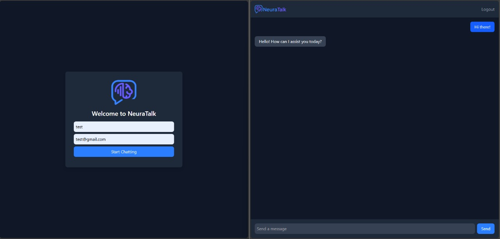

# NeuraTalk UI

This is the front end for NeuraTAlk application. It is a **Vue.js 3** application that uses a custom API to interact with [Stream Chat](https://getstream.io), your own [Neon](https://neon.tech) PostgreSQL database, and [Cohere AI](https://cohere.com/).



The Express backend API for this application can be found [here](https://github.com/YasserFat7alah/NeuraTalk/tree/main/neura-api).

<br/><br/>

## Installation
 
1. Clone the repository. || if not cloned yet
3. Run `npm install`
4. Create a `.env` file in the root directory and add the following environment variables:

```
VITE_API_URL=http://localhost:8000
```

5. Run the server with `npm run dev` and open the link given in the terminal.
6. Run the backend API > [learn more](https://github.com/YasserFat7alah/NeuraTalk/tree/main/neura-api/README.md)

<br/><br/>

  ##
> Running the backend API is not required to install the frontend, but necessary for functionality.
>
>  💡 You can reach me at [YasserFat7alah@gmail.com](mailto:yasserfat7alah@gmail.com) for more help.

